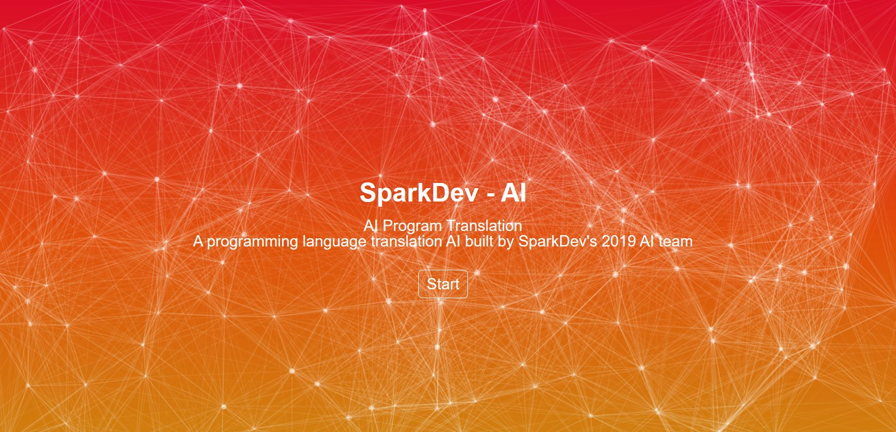

# ai-program-translation

### Objective
The goal of this project was to make a program translation AI that can convert code from one language to another to help developers in migrating legacy code and make collaboration easier. To this end, we employed a tree-to-tree neural network with encoder-decoder architecture and attention mechanism based on Dr. Chen’s paper.

### Dataset
The languages chosen for our project were **Javascript and Coffeescript**. Our training dataset consisted of 100,000 sample programs and Abstract Syntax Trees.

### Model
We used an **encoder-decoder** architecture with **parent-feeding attention** in order to better predict the translation for a given node.
The encoder is a **Tree-LSTM** that recursively computes embeddings for each subtree in the source tree from the bottom up. Then, when generating the translated tree, the attention computes the probability that a given node in the source tree corresponds to the node being generated in the target tree. It also chooses the node with the highest probability and passes its embedding to the decoder, which then generates a token in the target language from the embedding.

This model would then be saved to be used in our Flask web app that takes in a program and displays the translated output.

